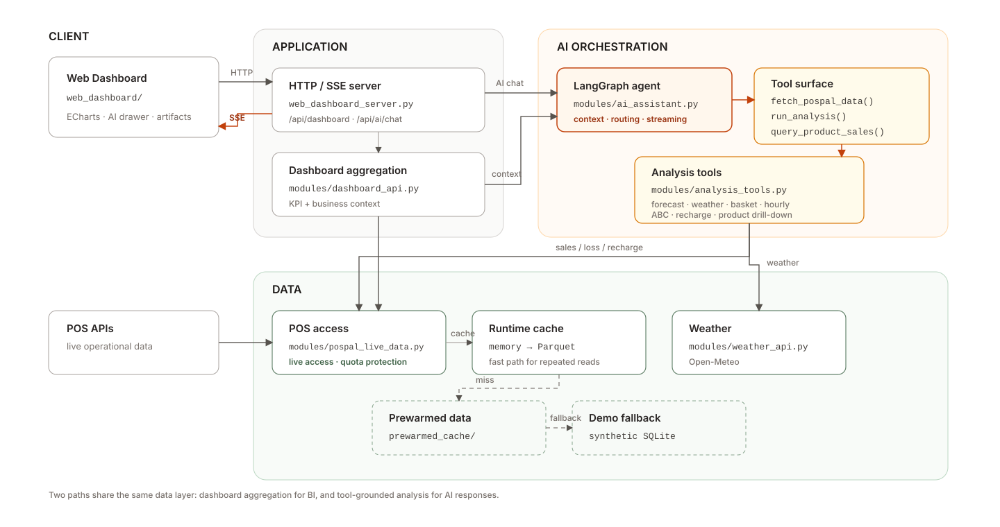

# AI-BI

> Conversational retail BI powered by LangGraph, deterministic analytics, and resilient POS data access.

[English](README.md) · [简体中文](README_zh.md)

[](https://www.python.org/)
[](https://github.com/langchain-ai/langgraph)
[](https://echarts.apache.org/)

AI-BI is the sanitized public version of a retail analytics system built for real store operations. It combines a browser dashboard with a LangGraph agent that can inspect business context, call deterministic Python tools, query product-level sales, and stream structured answers back to the UI.

**Principle:** let the LLM decide *what to inspect*; keep business calculations in explicit, testable code.

## Architecture

<p align="center">
  
</p>

The web app follows two main paths:

- **Dashboard:** browser → dashboard API → cached/live POS data.
- **AI:** browser → SSE endpoint → LangGraph → deterministic tools → streamed text and visual artifacts.

## What it can do

| Capability | Example |
|---|---|
| Sales forecast | Tomorrow / next-week estimates from historical sales |
| Weather impact | Compare weather conditions with sales performance |
| Basket analysis | Find products frequently purchased together |
| Hourly patterns | Revenue, traffic, and average-ticket peaks by hour |
| Product ABC | Identify core products and slow movers |
| Recharge health | Analyze stored-value usage and recharge inflow |
| Product drill-down | Query a specific product, merge same-barcode aliases, inspect trend and loss |

The agent can also return structured UI artifacts such as ECharts specs, KPI cards, comparison cards, checklists, callouts, and Markdown tables.

## Key modules

```text
web_dashboard/                 Browser dashboard + artifact renderer
web_dashboard_server.py        HTTP API + SSE streaming
modules/ai_assistant.py        LangGraph agent + tool routing
modules/analysis_tools.py      Deterministic retail analysis tools
modules/dashboard_api.py       BI aggregation
modules/pospal_live_data.py    POS access + cache/fallback chain
modules/weather_api.py         Weather integration
skills/                        Domain analysis logic
tests/                         Python + frontend regression tests
```

## Quick start

```bash
git clone https://github.com/Kevoyuan/AI-BI.git
cd AI-BI

python3 -m venv .venv
source .venv/bin/activate      # Windows: .venv\Scripts\activate
pip install -r requirements.txt
cp .env.example .env
```

For AI chat, configure at least:

```env
DEEPSEEK_API_KEY=your_api_key_here
DEEPSEEK_BASE_URL=https://api.deepseek.com
DEEPSEEK_MODEL=deepseek-flash
```

Run:

```bash
python3 web_dashboard_server.py --host 127.0.0.1 --port 8600
```

Open `http://127.0.0.1:8600`.

Live POS credentials are optional for the public demo; the data layer can fall back to sanitized prewarmed data and synthetic SQLite datasets.

## Test

```bash
PYTHONPATH=. pytest -v
node --test tests/*.test.mjs
```

## Public showcase scope

This repository is derived from a privately deployed retail system. Credentials, customer-identifying information, store-specific configuration, and private operational data have been removed or replaced.

The public version focuses on the reusable engineering ideas: **agent orchestration, grounded analytics, streaming UX, cache/fallback design, and end-to-end retail BI workflows.**
