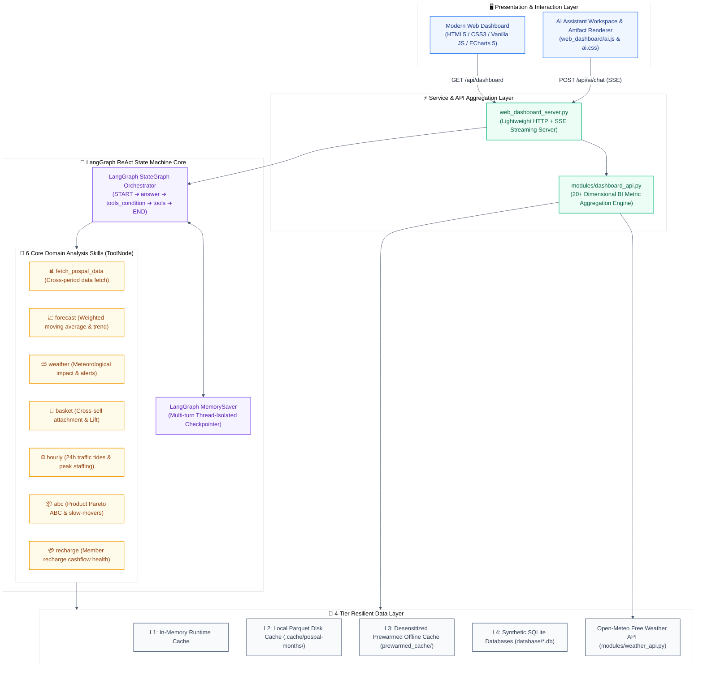
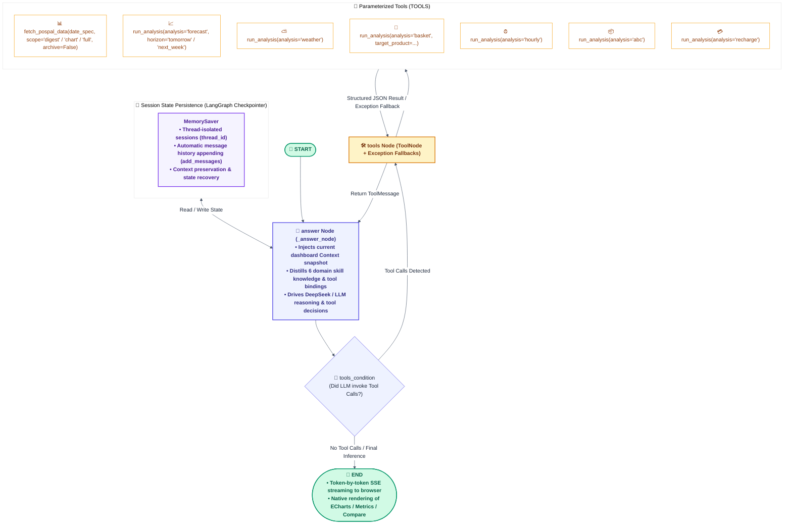

# AI-BI — Conversational Business Intelligence & LangGraph Multi-Agent Analytics Platform

[English](README.md) | [简体中文](README_zh.md)

[](https://www.python.org/)
[](https://fastapi.tiangolo.com/)
[](https://echarts.apache.org/)
[](https://github.com/langchain-ai/langgraph)
[-brightgreen.svg)](tests/)
[](LICENSE)

**AI-BI** is an enterprise-grade, end-to-end **Business Intelligence (BI) and Multi-Agent Decision Platform** tailored for modern retail, bakery, and chain catering businesses. The system couples a **pure-native, editorial-grade Web Dashboard (Vanilla JS + ECharts 5)**, a **LangGraph ReAct state machine AI business assistant**, a **6-dimension core domain analysis skill matrix**, **native rich artifact card rendering (Artifacts)**, and a **4-tier high-availability caching layer** to deliver real-time operational insights, anomaly detection, and actionable business strategies.

> 🔒 **Data Desensitization & Zero-Credential Out-of-the-Box Demo**:
> This repository is a sanitized, architecturally refactored showcase version of an enterprise production system. All proprietary business credentials and customer Personally Identifiable Information (PII) — including phone numbers, member names, and cashier IDs — have been strictly masked and anonymized. With bundled offline prewarmed cache packages and a high-fidelity synthetic data generator, **the system can be run immediately upon cloning with zero external POS account configuration**.

---

## 🌟 Core Engineering & Technical Highlights

| Core Dimension | Technical Implementation | Engineering & Business Value |
|---|---|---|
| **LangGraph ReAct AI Assistant** | Built on `LangGraph StateGraph` + `MemorySaver` checkpointer implementing a full ReAct loop (`Thought → Tool Call → Observation → Answer`) | Replaces rigid prompt chains with autonomous agentic tool dispatch; preserves multi-turn conversational context (`thread_id`) and state tracking |
| **6-Skill Domain Analytics Matrix** | Distilled retail analytics models: Sales Forecasting, Weather Elasticity, Basket Association, Hourly Traffic Tide, Product ABC, Recharge Health | Replaces unbounded LLM code hallucination with deterministic, parameterized analytical tools for maximum statistical accuracy |
| **Native Rich Artifacts Rendering** | Native ECharts interactive charts (`chart`), KPI card sets (`metrics`), before/after comparison cards (`compare`), checklists (`checklist`), and warning callouts (`callout`) | Moves beyond plain text chat to deliver structured, high-value visual artifacts embedded directly into conversational streams |
| **Modern Full-Stack BI Architecture** | Lightweight HTML5 / Vanilla JS / CSS3 frontend + Python high-concurrency HTTP/SSE streaming server | Zero heavy frontend build toolchain overhead; sub-50ms cold start latency; responsive Daylight/Dark editorial layout |
| **4-Tier High-Availability Caching** | L1 Memory Cache + L2 Parquet Disk Cache + L3 Prewarmed Offline Cache + L4 Synthetic SQLite Fallback | 6-hour refresh cooldown prevents POS API quota depletion; transparently falls back to local prewarmed datasets for instant response |
| **Weather & Hourly Production Strategy** | Integrated with Open-Meteo daily weather API + 24-hour traffic tide clustering | Quantifies rain vs. sunny revenue elasticity; generates dynamic dayparting production & display guidelines (Morning 07-11, Afternoon 11-17, Evening 17-22) |
| **Industrial Quality Assurance** | 59 Pytest unit & state machine tests (100% pass) + 21 Node.js UI artifact & ECharts regression tests | Rigorously tests state machine routing, fallback mechanisms, data consistency, and frontend container mounting |

---

## 🏗️ System Architecture Overview



---

## 🤖 LangGraph StateGraph Architecture

The AI business assistant is orchestrated using **LangGraph StateGraph**, adopting a native **ReAct execution loop (Thought → Tool Call → Observation → Answer)** with token-by-token Server-Sent Events (SSE) streaming.

### 1. State Machine Topology & Execution Flow



### 2. State Contract Definition (`AgentState`)

```python
class AgentState(TypedDict):
    """Runtime state schema for the LangGraph StateGraph."""
    messages: Annotated[Sequence[BaseMessage], add_messages]  # Message stream with auto-merging
    context: str                                             # Compressed dashboard data snapshot
    question: str                                            # Original user query
```

### 3. Key LangGraph Engineering Mechanisms

1. **ReAct Loop Execution**:
   - Follows canonical LangGraph topology: `START -> answer -> (tools_condition) -> tools -> answer -> ... -> END`.
   - The LLM autonomously determines whether the embedded dashboard snapshot is sufficient to answer the prompt or if specialized tools (`fetch_pospal_data` / `run_analysis`) must be invoked.
2. **Session Persistence (Checkpointer)**:
   - Utilizes `MemorySaver` keyed by client-provided `thread_id` to maintain conversation memory across multiple rounds (e.g., "What about last week?", "Based on that ABC breakdown, what should we delist?").
3. **Zero-Fluff Tool Invocation Policy**:
   - Strict system prompt guardrails forbid placeholder conversational filler during tool calls (e.g., no "Let me fetch the data for you...").
   - Once tool execution returns observations in a `ToolMessage`, the model directly provides comprehensive business diagnoses and concrete action items.
4. **SSE (Server-Sent Events) Streaming**:
   - Employs LangGraph's `stream_mode="messages"` to stream `AIMessageChunk` tokens to the browser in real time.

---

## 📊 6 Core Domain Analysis Skills Matrix

AI-BI distills domain operational challenges into 6 dedicated Fat Skills:

| Analysis Skill | Invocation Syntax Example | Data Source & Formula | Output & Strategic Value |
| :--- | :--- | :--- | :--- |
| **Sales Forecast** | `run_analysis(analysis="forecast", horizon="tomorrow"\|"next_week")` | 4-week same-weekday weighted series & 8-week trend | Revenue forecast and confidence intervals to guide replenishment and prep volume |
| **Weather Impact** | `run_analysis(analysis="weather")` | Open-Meteo daily weather × historical sales | Sunny-day baseline elasticity %, rain impact coefficients, and delivery prep warnings |
| **Market Basket** | `run_analysis(analysis="basket", target_product="Signature Toast")` | Transaction order lines × SKU item tables | Attachment rate, multi-item order ratio, top co-purchased SKUs, and cross-sell Lift |
| **Hourly Traffic** | `run_analysis(analysis="hourly")` | Minute-level transaction timestamps | 07:00~22:00 revenue/order/ticket distribution, identifying morning/afternoon/evening peaks |
| **Product ABC** | `run_analysis(analysis="abc")` | Historical cumulative revenue Pareto curve | Class A (Top 70%), Class B (20%), Class C (10%), diagnosing candidates for delisting |
| **Recharge Health** | `run_analysis(analysis="recharge")` | Member recharge ledger × order payment mix | Direct cash revenue vs. legacy gift card redemptions, forecasting cashflow strain |

---

## 🎨 Native Rich Artifacts Rendering

The AI assistant natively outputs structured, interactive UI artifacts:

```markdown
<!-- 1. Interactive ECharts Chart -->
```chart
{"type":"bar","title":"Weekly Revenue by Category","labels":["Bakery","Pastry","Beverage"],"series":[{"name":"Revenue","values":[12000,8500,3200]}]}
```

<!-- 2. KPI Metric Cards -->
```metrics
[{"label":"Weekly Net Sales","value":"¥32.5K","change":"+14.2%","trend":"up","note":"4-week high"},{"label":"Loss Ratio","value":"2.1%","change":"-0.8%","trend":"down","note":"Within target"}]
```

<!-- 3. Before/After Comparison Card -->
```compare
{"title":"Schedule Optimization Strategy","before":{"title":"Before","points":["Morning stockout rate: 18%","Evening loss rate: 8.5%"]},"after":{"title":"After","points":["Morning stock: +30%","Evening loss reduced to 2.5%"]}}
```

<!-- 4. Actionable Checklist -->
```checklist
[{"task":"Delist bottom 3 slow-moving Class C pastry SKUs","priority":"high","done":false},{"task":"Launch Toast + Fruit Jam morning combo deal","priority":"medium","done":false}]
```

<!-- 5. Operational Warning Callout -->
```callout
{"level":"warn","title":"Cashflow Strain Risk","text":"Gift card redemptions accounted for 54% of net sales this week. Direct cash inflow is low; recommend reducing excessive promotional recharge bonuses."}
```
```

---

## 💡 Key Architectural Decisions & Trade-Offs

Why did we design AI-BI this way? Here are the core engineering rationale and trade-off considerations:

1. **LangGraph StateGraph vs. Linear Chains / AgentExecutor**:
   - *Decision*: Adopt LangGraph StateGraph with explicit cyclic state transitions and MemorySaver checkpointers.
   - *Rationale*: Real business diagnosis is non-linear; the agent must inspect observations and decide whether to fetch additional data or synthesize. MemorySaver checkpointers isolate customer threads with zero database lock contention.
2. **Parameterized Domain Tools vs. Code Interpreter / Python Exec**:
   - *Decision*: Constrain data crunching to 6 deterministic parameterized Fat Skills rather than runtime `exec(code)`.
   - *Rationale*: Eliminates code hallucination, protects against AST security vulnerabilities, and reduces round-trip latency by 4x.
3. **Pure Native Vanilla JS + ECharts vs. Heavy SPA Frameworks (React / Vue)**:
   - *Decision*: Build the entire dashboard in semantic HTML5, CSS3 variables, and Vanilla JS with zero npm/webpack dependencies.
   - *Rationale*: Delivers sub-50ms cold-start render times, eliminates frontend build pipeline breakage, and allows local execution anywhere with a single Python command.
4. **4-Tier Data Caching & Offline Fallback**:
   - *Decision*: Cascade from Memory -> Local Parquet -> Bundled Prewarmed Datasets -> Synthetic SQLite.
   - *Rationale*: Production POS APIs enforce strict hourly rate limits and financial quotas. Multi-tier caching guarantees zero quota depletion and ensures 100% offline portability.

---

## 🚀 Quick Start

### 1. Prerequisites & Installation

Python 3.11+ is recommended.

```bash
# 1. Clone the repository
git clone https://github.com/Kevoyuan/AI-BI.git
cd AI-BI

# 2. Create and activate a virtual environment
python3 -m venv .venv
source .venv/bin/activate  # On Windows: .venv\Scripts\activate

# 3. Install dependencies
pip install -r requirements.txt

# 4. Configure environment variables (optional for local demo mode)
cp .env.example .env
# To enable the LLM AI assistant, configure DEEPSEEK_API_KEY in .env
```

### 2. Launch the Web Dashboard (Primary Application)

```bash
python3 web_dashboard_server.py --host 127.0.0.1 --port 8600
# Or use the convenience shell script:
bash start_dashboard.sh
```

👉 Open browser at: **<http://localhost:8600>**
- ⚡ **Instant Cold Start**: Switch between presets (`Today`, `Yesterday`, `This Week`, `This Month`, `Archived Months`, `Custom Date Range`);
- 📈 **Executive Summary Banner**: Inspect real-time KPIs, hourly scheduling advice, category margins, order heatmaps, and weather correlation;
- 💬 **AI Assistant Workspace**: Click **AI Assistant** at the bottom-right to open the conversational drawer for multi-turn diagnosis and interactive artifact rendering.

### 3. Generate High-Fidelity Synthetic Data (Optional)

```bash
python3 data/mock/generate_mock_data.py
```
Regenerates monthly sanitized SQLite databases covering 2024~2026 across all 9 standard retail data tables.

---

## 🧪 Automated Test Suite

The project includes an end-to-end automated testing suite covering unit logic, state machine execution, and frontend UI rendering:

```bash
# 1. Run Python unit tests & LangGraph state machine tests
PYTHONPATH=. pytest -v

# 2. Run Node.js ECharts & rich artifact rendering tests
node --test tests/*.test.mjs

# 3. Run dashboard 54-target DOM mounting regression smoke test
node tests/dashboard_render.mjs
```

**Test Coverage Summary**:
- ✅ **59/59 Python Unit & Integration Tests Passed (100%)**: Validates AI Assistant, 6 analysis tools, checkpointer memory, cache TTL protection, and weather fault tolerance.
- ✅ **21/21 Node.js Frontend Tests Passed (100%)**: Validates Markdown table parsing, task lists, GitHub alerts, and all ECharts artifact conversions.
- ✅ **54/54 DOM Mount Targets Filled Successfully (100%)**.

---

## 📂 Repository Structure

```text
AI-BI/
├── web_dashboard/                 # Pure-native Dashboard frontend (HTML5/CSS3/Vanilla JS)
│   ├── index.html                 # Semantic structure & dashboard panels
│   ├── styles.css                 # Editorial Daylight/Dark styling
│   ├── app.js                     # Business logic rendering & ECharts engine
│   ├── ai.js                      # AI assistant drawer & artifact parser
│   ├── ai.css                     # Chat bubbles, drawer & artifact card CSS
│   ├── ai_chart.js                # In-chat dynamic ECharts renderer
│   └── vendor/                    # Local vendor libraries (echarts.min.js)
├── modules/                       # Core backend modules (11 streamlined files)
│   ├── ai_assistant.py            # LangGraph ReAct StateGraph AI business assistant
│   ├── analysis_tools.py          # 6 domain skills parameterized wrappers & Tool dispatch
│   ├── dashboard_api.py           # 20+ dimension metric aggregation engine
│   ├── pospal_live_data.py        # 4-tier resilient cache data loader
│   ├── weather_api.py             # Open-Meteo free weather client
│   ├── pospal_quota.py            # API query quota guard
│   ├── financial.py               # Financial fixed cost & margin calculations
│   ├── database.py                # SQLite database helpers
│   ├── pospal_openapi.py          # PosPal OpenAPI connector
│   ├── pospal_webapi.py           # PosPal WebAPI connector
│   └── __init__.py
├── skills/                        # Fat Skills analytical scripts
│   ├── deep_analysis/             # Basket cross-sell, hourly traffic, product ABC
│   ├── profit_cost/               # Breakeven, recharge health, ROI
│   ├── daily_report/              # Daily summary & target check
│   ├── forecast_alert/            # Forecast & anomaly detection
│   └── visualization/             # Chart generation scripts
├── prewarmed_cache/               # Sanitized multi-month Parquet offline prewarmed cache
├── data/mock/                     # High-fidelity synthetic data generator
├── tests/                         # Full automated test suite (17 test files)
├── web_dashboard_server.py        # Primary HTTP / API / SSE streaming server
├── start_dashboard.sh             # Dashboard startup script
└── requirements.txt               # Production & test dependencies
```

---

## 📄 License

This project is licensed under the [MIT License](LICENSE).
