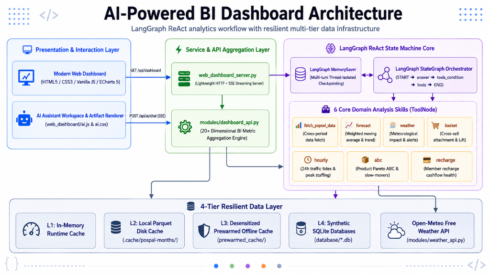

# AI-BI — Conversational Retail Analytics with LangGraph

[English](README.md) | [简体中文](README_zh.md)

[](https://www.python.org/)
[](https://github.com/langchain-ai/langgraph)
[](https://echarts.apache.org/)

**AI-BI** is the sanitized public portfolio version of a privately deployed retail analytics system originally built for real bakery operations. It combines a web dashboard with a **LangGraph ReAct agent** that can inspect business context, call deterministic analytical tools when more data is needed, and return both natural-language explanations and structured visual artifacts.

The public version preserves the core engineering patterns of the original system — POS data ingestion, dashboard aggregation, LangGraph orchestration, tool-grounded analytics, caching, fallback handling, and streamed AI responses — while removing or replacing private credentials, store-specific identifiers, sensitive business data, and deployment-specific configuration.

The project follows a simple design principle: **use the LLM for reasoning and tool selection, but keep business calculations inside explicit, testable Python functions.**

> **Sanitized public version**
>
> This repository is intended to make the architecture inspectable and reproducible without exposing the private operational dataset. Live POS credentials and customer-identifying information are not required for the local demo: the data layer can fall back to bundled prewarmed data and synthetic SQLite datasets. The AI assistant itself requires an OpenAI-compatible model API key (DeepSeek is configured by default).

### What was changed for the public repository?

- Removed real credentials, customer-identifying information, and store-specific private data.
- Replaced private operational datasets with sanitized prewarmed data and synthetic SQLite demo datasets.
- Generalized location-, finance-, and environment-specific configuration where appropriate.
- Preserved the core dashboard, agent orchestration, analytical tools, caching, and POS integration architecture.
- Added public-facing documentation, reproducible setup instructions, and demo-friendly fallback paths.

---

## What the project demonstrates

- **Agentic AI orchestration** with LangGraph `StateGraph`, `ToolNode`, `tools_condition`, and `MemorySaver`.
- **Tool-grounded analytics** instead of free-form LLM-generated calculations.
- **Retail-specific analysis** for forecasting, weather impact, basket analysis, hourly sales patterns, product ABC analysis, and recharge health.
- **Streaming AI UX** through Server-Sent Events (SSE), so responses can be rendered incrementally in the browser.
- **Structured AI outputs** including ECharts charts, KPI cards, comparison cards, checklists, alerts, and tables.
- **Resilient data access** through memory, local Parquet cache, prewarmed offline data, and synthetic SQLite fallback.
- **Automated tests** covering agent routing, analytical tools, cache behavior, backend endpoints, and frontend rendering.
- **Production-derived architecture** adapted from a privately deployed retail workflow into a reproducible public showcase.

---

## System overview

<p align="center">
  
</p>

```text
Browser Dashboard
  ├── GET /api/dashboard
  └── POST /api/ai/chat (SSE)
             │
             ▼
Python HTTP Server
  ├── Dashboard aggregation
  └── LangGraph ReAct agent
          │
          ├── current dashboard context
          ├── fetch_pospal_data(...)
          └── run_analysis(...)
                  │
                  ├── forecast
                  ├── weather
                  ├── basket
                  ├── hourly
                  ├── abc
                  └── recharge
             │
             ▼
Resilient Data Layer
  ├── in-memory cache
  ├── Parquet cache
  ├── prewarmed sanitized data
  └── synthetic SQLite fallback
```

### Core runtime paths

| Layer | Main files | Responsibility |
|---|---|---|
| Web UI | `web_dashboard/` | Dashboard, AI drawer, artifact rendering, ECharts visualizations |
| HTTP/SSE server | `web_dashboard_server.py` | Static files, `/api/dashboard`, `/api/ai/chat`, SSE streaming |
| Agent orchestration | `modules/ai_assistant.py` | LangGraph state, ReAct loop, memory, tool calling, streamed answers |
| Analytical tools | `modules/analysis_tools.py` | Parameterized retail-analysis entry points |
| BI aggregation | `modules/dashboard_api.py` | Dashboard metrics and business-data aggregation |
| Data access | `modules/pospal_live_data.py`, `modules/pospal_*.py` | POS access, caching, quota protection, offline fallback |
| Weather | `modules/weather_api.py` | Open-Meteo integration |
| Tests | `tests/` | Python agent/backend tests and Node.js frontend regression tests |

---

## LangGraph agent design

The assistant uses an explicit cyclic graph rather than a fixed prompt chain:

```text
START
  │
  ▼
answer node
  │
  ├── no tool needed ───────────────► END
  │
  └── tool call
        │
        ▼
     ToolNode
        │
        ▼
   observation
        │
        └───────────────────────────► answer node
```

The agent receives a compressed snapshot of the dashboard as context. It can answer directly when the required information is already present, or call tools when the user asks for a different time range or a deeper analysis.

### State and memory

`MemorySaver` is keyed by `thread_id`, allowing multi-turn questions such as:

```text
"Which products were weak last month?"
"What about weekends only?"
"Based on that, what should I remove from the menu?"
```

The conversation state is kept separately from the business-data retrieval logic, which makes the tool layer easier to test and reason about.

### Why tools instead of generated Python?

Earlier analytics prototypes often let an LLM write arbitrary analysis code. AI-BI takes the opposite approach: the model chooses from explicit, parameterized tools, while calculations remain deterministic Python functions.

This gives three practical advantages:

1. **Reproducibility** — the same tool parameters produce the same calculation path.
2. **Safer execution** — the model does not execute arbitrary generated Python.
3. **Testability** — business calculations can be unit-tested independently of the LLM.

---

## Six retail analysis capabilities

| Capability | Example tool call | What it returns |
|---|---|---|
| **Sales Forecast** | `run_analysis(analysis="forecast", horizon="tomorrow")` | Short-horizon sales estimate and confidence range based on recent history |
| **Weather Impact** | `run_analysis(analysis="weather")` | Historical sales sensitivity to weather plus weather-related operating signals |
| **Basket Analysis** | `run_analysis(analysis="basket", target_product="...")` | Co-purchase patterns, attachment rate, multi-item share, and Lift |
| **Hourly Sales Patterns** | `run_analysis(analysis="hourly")` | Hourly revenue, order count, average ticket, and daypart peaks |
| **Product ABC** | `run_analysis(analysis="abc")` | Revenue-based A/B/C segmentation and slow-moving product candidates |
| **Recharge Health** | `run_analysis(analysis="recharge")` | Recharge inflow, stored-value usage, and cash-flow-related indicators |

These tools are intentionally narrower than a generic code interpreter. The goal is to expose calculations that can be reviewed, tested, and reused across conversations.

---

## Structured AI outputs

The assistant can return more than plain text. The frontend parses structured fenced blocks and renders them as native UI components.

Supported artifact types include:

```text
chart       → ECharts visualization
metrics     → KPI cards
compare     → before/after or option comparison
checklist   → actionable task list
callout     → warning / recommendation block
Markdown    → tables and supporting explanation
```

Example:

````markdown
```metrics
[
  {"label":"Weekly Net Sales","value":"¥32.5K","change":"+14.2%","trend":"up"},
  {"label":"Loss Ratio","value":"2.1%","change":"-0.8%","trend":"down"}
]
```
````

This keeps the conversational interface useful for business analysis without forcing every answer into prose.

---

## Streaming responses with SSE

`POST /api/ai/chat` responds as `text/event-stream`. LangGraph runs with `stream_mode="messages"`, and `AIMessageChunk` tokens are forwarded to the browser as they are produced.

```text
User question
   │
   ▼
LangGraph agent
   │
   ├── optional tool calls
   │
   ▼
AIMessageChunk stream
   │
   ▼
SSE endpoint
   │
   ▼
Browser renders the answer incrementally
```

SSE is used here because the communication is primarily server-to-browser during generation and does not require a bidirectional WebSocket connection.

---

## Data resilience and demo mode

The public version can operate without live POS credentials by moving through a fallback chain:

```text
L1  In-memory runtime cache
 ↓
L2  Local Parquet cache
 ↓
L3  Bundled prewarmed sanitized datasets
 ↓
L4  Synthetic SQLite datasets
```

The underlying live-data path is retained from the operational architecture and includes configurable cache TTLs and quota protection so repeated dashboard requests do not unnecessarily hit the external POS source.

Open-Meteo is used for weather data and does not require an API key.

---

## Quick start

### Requirements

- Python 3.11+
- An OpenAI-compatible API key if you want to use the conversational AI assistant
- POS credentials are optional for the public demo

### Install

```bash
git clone https://github.com/Kevoyuan/AI-BI.git
cd AI-BI

python3 -m venv .venv
source .venv/bin/activate        # Windows: .venv\Scripts\activate
pip install -r requirements.txt

cp .env.example .env
```

To enable the AI assistant, set at least:

```env
DEEPSEEK_API_KEY=your_api_key_here
DEEPSEEK_BASE_URL=https://api.deepseek.com
DEEPSEEK_MODEL=deepseek-chat
```

### Run

```bash
python3 web_dashboard_server.py --host 127.0.0.1 --port 8600
```

Then open:

```text
http://127.0.0.1:8600
```

A convenience launcher is also included for Unix-like environments:

```bash
bash start_dashboard.sh
```

### Optional: regenerate synthetic demo data

```bash
python3 data/mock/generate_mock_data.py
```

---

## Testing

Python tests cover the LangGraph assistant, analysis tools, dashboard API, cache behavior, POS adapters, and weather-related logic.

```bash
PYTHONPATH=. pytest -v
```

Frontend regression tests use Node's built-in test runner:

```bash
node --test tests/*.test.mjs
node tests/dashboard_render.mjs
```

The README intentionally avoids hard-coding a test-count badge so the documentation does not become stale as the suite grows.

---

## Repository structure

```text
AI-BI/
├── api/
│   └── index.py                  # Authenticated Vercel-compatible entry point
├── data/
│   └── mock/                     # Synthetic demo-data generator
├── database/                     # Local SQLite demo data
├── docs/
│   └── images/                   # Architecture and product diagrams
├── modules/
│   ├── ai_assistant.py           # LangGraph ReAct agent and streamed responses
│   ├── analysis_tools.py         # Parameterized analytical tools
│   ├── dashboard_api.py          # BI aggregation layer
│   ├── pospal_live_data.py       # Live/cache/fallback data access
│   ├── pospal_openapi.py         # POS OpenAPI integration
│   ├── pospal_webapi.py          # POS Web integration
│   ├── pospal_quota.py           # Quota protection
│   ├── database.py               # SQLite helpers
│   └── weather_api.py            # Open-Meteo integration
├── prewarmed_cache/              # Sanitized offline datasets
├── skills/                       # Domain-analysis scripts and reference logic
├── tests/                        # Python + Node.js tests
├── web_dashboard/                # HTML/CSS/JS dashboard and artifact renderer
├── web_dashboard_server.py       # HTTP API and SSE server
├── start_dashboard.sh            # Convenience launcher
├── requirements.txt
└── .env.example
```

---

## Public showcase scope and limitations

AI-BI is the **public, sanitized representation of a privately deployed operational system**. The distinction matters: the repository demonstrates the real architecture and workflow patterns, but the included datasets, configuration, and runtime environment have been adapted for safe public inspection and reproducibility.

Current boundaries of the public version:

- The agent selects from a constrained set of domain tools rather than creating arbitrary analyses at runtime.
- `MemorySaver` provides in-process conversational state in this public implementation; it is not a distributed persistence layer.
- The local server uses Python's `ThreadingHTTPServer`; it is intentionally lightweight rather than a full production web framework.
- Synthetic and prewarmed datasets reproduce the data shape and workflow without exposing the private operational dataset.
- Production deployment concerns such as organization-wide authorization, distributed state, centralized observability, and horizontal scaling are outside the scope of this public showcase.

The repository therefore focuses on the parts that are most useful to inspect publicly: **agent orchestration, grounded analytics, retail data workflows, reliability mechanisms, caching/fallback design, and an end-to-end user-facing AI experience**.
