# AI-BI

> 基于 LangGraph、确定性分析工具和弹性 POS 数据层的对话式零售 BI。

[English](README.md) · [简体中文](README_zh.md)

[](https://www.python.org/)
[](https://github.com/langchain-ai/langgraph)
[](https://echarts.apache.org/)

AI-BI 是一个真实零售经营分析系统的公开脱敏版本。它把浏览器 Dashboard 与 LangGraph Agent 结合起来：Agent 可以读取经营上下文、调用确定性的 Python 工具、查询单品销售，并将文本、图表和结构化结果流式返回前端。

**核心原则：** LLM 决定“该看什么”，业务计算留在显式、可测试的代码里。

## 架构

```mermaid
flowchart LR
    browser["web_dashboard/"]
    server["web_dashboard_server.py"]
    dashboard["modules/dashboard_api.py"]
    agent["modules/ai_assistant.py"]
    tools["fetch_pospal_data<br/>run_analysis<br/>query_product_sales"]
    analysis["modules/analysis_tools.py"]
    pos["modules/pospal_live_data.py"]
    weather["modules/weather_api.py"]
    live["POS APIs"]
    memory["memory cache"]
    parquet["Parquet cache"]
    prewarmed["prewarmed_cache/"]
    sqlite["SQLite demo data"]

    browser -->|"GET /api/dashboard"| server
    browser -->|"POST /api/ai/chat"| server
    server --> dashboard
    server --> agent
    agent --> tools
    tools --> analysis
    tools --> pos
    analysis --> pos
    analysis --> weather
    dashboard --> pos
    pos --> live
    pos --> memory
    memory -->|"miss"| parquet
    parquet -->|"miss"| prewarmed
    prewarmed -->|"fallback"| sqlite
    agent -. "SSE" .-> browser
```



Dashboard 链路是 `browser → server → dashboard_api → POS/cache`。AI 请求进入 `ai_assistant`，由 Agent 选择明确的工具执行，再通过 SSE 把结果流式返回浏览器。

## 能力

| 能力 | 说明 |
|---|---|
| 销售预测 | 基于历史销售预测明日 / 下周销售 |
| 天气影响 | 分析天气变化与销售表现的关系 |
| 购物篮分析 | 找出高频共购商品和连带机会 |
| 分时销售 | 识别各小时营收、客流和客单价高峰 |
| 商品 ABC | 区分核心商品与滞销候选 |
| 储值健康度 | 分析充值流入与储值消费 |
| 单品明细 | 查询具体商品，合并同条码改名记录，并查看趋势与报损 |

Agent 还可以输出 ECharts、KPI 卡片、方案对比、Checklist、Callout 和 Markdown 表格等结构化结果。

## 核心模块

```text
web_dashboard/                 Dashboard + Artifact Renderer
web_dashboard_server.py        HTTP API + SSE Streaming
modules/ai_assistant.py        LangGraph Agent + Tool Routing
modules/analysis_tools.py      确定性零售分析工具
modules/dashboard_api.py       BI 指标聚合
modules/pospal_live_data.py    POS 接入 + Cache/Fallback
modules/weather_api.py         天气数据接入
skills/                        领域分析逻辑
tests/                         Python + 前端回归测试
```

## 快速开始

```bash
git clone https://github.com/Kevoyuan/AI-BI.git
cd AI-BI

python3 -m venv .venv
source .venv/bin/activate      # Windows: .venv\Scripts\activate
pip install -r requirements.txt
cp .env.example .env
```

启用 AI 对话至少配置：

```env
DEEPSEEK_API_KEY=your_api_key_here
DEEPSEEK_BASE_URL=https://api.deepseek.com
DEEPSEEK_MODEL=deepseek-flash
```

启动：

```bash
python3 web_dashboard_server.py --host 127.0.0.1 --port 8600
```

浏览器打开 `http://127.0.0.1:8600`。

公开 Demo 不强制要求真实 POS 凭据；数据层可以回退到脱敏预热数据和合成 SQLite 数据集。

## 测试

```bash
PYTHONPATH=. pytest -v
node --test tests/*.test.mjs
```

## 公开版范围

本仓库来自一个私有部署的零售经营系统。真实凭据、客户识别信息、门店私有配置和运营数据均已删除或替换。

公开版聚焦可复用的工程设计：**Agent 编排、Grounded Analytics、流式交互、缓存 / 降级链路，以及端到端零售 BI 工作流。**
