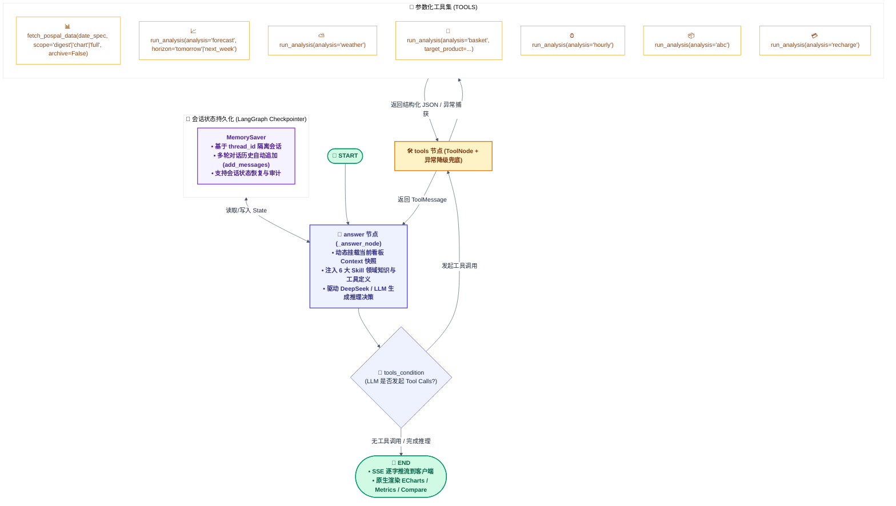

# AI-BI — 智能商业分析与多智能体决策平台
### Conversational Business Intelligence & LangGraph Multi-Agent Analytics Platform

[English](README.md) | [简体中文](README_zh.md)

[](https://www.python.org/)
[](https://fastapi.tiangolo.com/)
[](https://echarts.apache.org/)
[](https://github.com/langchain-ai/langgraph)
[-brightgreen.svg)](tests/)
[](LICENSE)

**AI-BI** 是一个面向现代零售与连锁餐饮场景的**企业级端到端商业智能（BI）与大模型多智能体（Multi-Agent）决策系统**。系统融合了**纯原生精美 Web Dashboard（Vanilla JS + ECharts 5）**、**LangGraph ReAct 状态机 AI 经营助手**、**6 大零售经营深度分析 Skills**、**富工件 (Artifacts) 原生卡片渲染**、以及 **4 级多层缓存与配额防穿透机制**，为门店提供毫秒级指标聚合、经营诊断与自动化策略建议。

> 🔒 **数据脱敏与开箱即用说明**：
> 本仓库为企业实战商业系统的架构重塑与开源展示版本，已全面剔除私有商业凭据与客户 PII 隐私信息（手机号掩码、会员姓名模糊化、收银员/门店匿名化）。内置高保真全量合成数据生成器与脱敏离线预热包，**克隆后无需真实收银机账号即可一键启动完整体验全部功能**。

---

## 🌟 核心工程与技术亮点 (Engineering Highlights)

| 核心维度 | 关键技术实现 | 业务与工程价值 |
|---|---|---|
| **LangGraph 状态机 AI 经营助手** | 基于 `LangGraph StateGraph` + `MemorySaver` 实现 ReAct 循环（Thought → Tool Call → Observation → Answer） | 告别硬编码 Prompt，模型自主决策何时调用数据与分析工具；支持会话持久化 (`thread_id`) 与多轮上下文追踪 |
| **6 大核心分析 Skills 矩阵** | 深度提炼零售餐饮行业经营模型：销售预测、天气量化、购物篮连带、时段客流、商品 ABC、储值健康度 | 将复杂的业务计算收敛为确定性参数化工具，兼顾高精度的统计指标与大模型的归纳推理能力 |
| **富工件 (Artifacts) 原生渲染** | 原生 ECharts 交互图表、核心指标卡组 (`metrics`)、方案对比卡 (`compare`)、行动清单 (`checklist`)、预警呼出框 (`callout`) | 摆脱传统单调纯文本聊天，以结构化、高颜值的交互组件输出经营诊断与行动建议 |
| **全栈现代 BI 架构** | 原生 HTML5 / Vanilla JS / CSS3 独立前端 + Python 高并发轻量服务端 + 双向 SSE 流式推送 | 消除重型前端框架构建包袱，首屏毫秒级冷启动；全中文 Daylight/Dark 现代报刊质感排版 |
| **4 级多层高可用缓存** | 内存运行时缓存 + Parquet 磁盘持久缓存 + 预热离线包兜底 + SQLite 合成数据兜底 | 6小时防穿透冷却保护收银接口配额；当无真实 POS 凭证或离线时平滑回退，实现零摩擦毫秒级体验 |
| **天气联动与时段排产策略** | 接入 Open-Meteo 逐日气象 API + 24小时客流潮汐模型 | 自动量化晴天/雨天实收弹性，动态生成早市(07-11)、午后茶歇(11-17)、晚市高峰(17-22)的精准排产与陈列指导 |
| **工业级测试与质量保障** | 59 个 Pytest 单元/状态机测试 (100% 通过) + 21 个 Node.js 前端富工件与 ECharts 渲染冒烟测试 | 严格把关状态机调度、工具降级、数据流一致性、无 Streamlit 耦合守护与前端渲染质量 |

---

## 🏗️ 全系统架构总览 (System Architecture)

```mermaid
%%{init: {'theme': 'base', 'themeVariables': { 'background': '#ffffff', 'primaryColor': '#EEF2FF', 'primaryTextColor': '#1E293B', 'primaryBorderColor': '#6366F1', 'lineColor': '#475569', 'secondaryColor': '#F0FDF4', 'tertiaryColor': '#FFFFFF', 'edgeLabelBackground':'#ffffff' }}}%%
flowchart TB
    classDef client fill:#EFF6FF,stroke:#3B82F6,stroke-width:1.5px,color:#1E3A8A;
    classDef server fill:#ECFDF5,stroke:#10B981,stroke-width:1.5px,color:#065F46;
    classDef agent fill:#F5F3FF,stroke:#8B5CF6,stroke-width:1.5px,color:#5B21B6;
    classDef tool fill:#FFFBEB,stroke:#F59E0B,stroke-width:1.5px,color:#92400E;
    classDef data fill:#F8FAFC,stroke:#64748B,stroke-width:1.5px,color:#334155;

    subgraph Client[" 🖥️ 前端展示与交互层 (Presentation Layer) "]
        WebDash["现代 Web Dashboard<br/>(HTML5 / CSS3 / Vanilla JS / ECharts 5)"]:::client
        AIDrawer["AI 对话工作台 & 富工件渲染器<br/>(web_dashboard/ai.js & ai.css)"]:::client
    end

    subgraph Server[" ⚡ 服务与 API 聚合层 (Service Layer) "]
        WebServer["web_dashboard_server.py<br/>(轻量多线程 HTTP + SSE 流式服务)"]:::server
        DashAPI["modules/dashboard_api.py<br/>(20+ 商业分析维度指标聚合引擎)"]:::server
    end

    subgraph LangGraphSystem[" 🧠 LangGraph ReAct 状态机智能中枢 "]
        Memory["LangGraph MemorySaver<br/>(多轮会话状态持久化 Checkpointer)"]:::agent
        Graph["LangGraph StateGraph 编排引擎<br/>(START ➔ answer ➔ tools_condition ➔ tools ➔ END)"]:::agent
        
        subgraph ToolsNode[" 🧰 6 大分析 Skills 工具集 (ToolNode) "]
            T1["📊 fetch_pospal_data (多期数据拉取)"]:::tool
            T2["📈 forecast (销售加权与趋势预测)"]:::tool
            T3["⛅ weather (气象影响量化与预警)"]:::tool
            T4["🛒 basket (购物篮连带与 Lift 提升度)"]:::tool
            T5["⏰ hourly (24h客流潮汐与波峰排产)"]:::tool
            T6["📦 abc (商品 ABC 结构与滞销诊断)"]:::tool
            T7["💳 recharge (储值健康与真实现金流)"]:::tool
        end
    end

    subgraph DataLayer[" 💾 4 级多层弹性数据层 (Data Abstraction Layer) "]
        L1["L1: 内存运行时缓存 (Memory Cache)"]:::data
        L2["L2: 本地 Parquet 磁盘缓存 (.cache/pospal-months/)"]:::data
        L3["L3: 脱敏离线预热包 (prewarmed_cache/)"]:::data
        L4["L4: SQLite 合成数据库 (database/*.db)"]:::data
        OpenMeteo["Open-Meteo 免费气象接口 (modules/weather_api.py)"]:::data
    end

    WebDash -->|GET /api/dashboard| WebServer
    AIDrawer -->|POST /api/ai/chat (SSE)| WebServer
    WebServer --> DashAPI
    WebServer --> Graph
    Graph <--> Memory
    Graph --> ToolsNode
    ToolsNode --> DataLayer
    DashAPI --> DataLayer
    DashAPI --> OpenMeteo
```

---

## 🤖 LangGraph 状态机深度架构 (LangGraph StateGraph Architecture)

AI 经营助手完全基于 **LangGraph StateGraph** 构建，采用 **ReAct 循环（Thought → Tool Call → Observation → Answer）**，实现了从意图理解、工具调度、会话记忆到流式工件输出的完整闭环。

### 1. 状态机拓扑与执行流图



### 2. 状态机状态契约 (`AgentState`)

```python
class AgentState(TypedDict):
    """LangGraph 状态机运行时上下文状态"""
    messages: Annotated[Sequence[BaseMessage], add_messages]  # 消息历史，自动支持合并与持久化
    context: str                                             # 当前看板指标压缩快照 (Snapshot)
    question: str                                            # 用户原始输入问题
```

### 3. LangGraph 核心工程机制

1. **ReAct 循环驱动**：
   - 采用标准 LangGraph 拓扑：`START -> answer -> (tools_condition) -> tools -> answer -> ... -> END`；
   - LLM 自主决定是否调用工具。如果当前看板数据快照足以回答，直接给出答复；若涉及跨期查询或复杂深度分析，则自动触发 `fetch_pospal_data` 或 `run_analysis`。
2. **会话持久化与隔离 (Checkpointer)**：
   - 接入 `MemorySaver`，通过前端传递的 `thread_id` 自动管理独立对话线程；
   - 保障多轮追问（例如：“那上周呢？”、“基于刚才的 ABC 分析给出淘汰方案”）具备准确的上下文感知能力。
3. **零废话工具行为约束**：
   - Prompt 级强制约束：模型发起工具调用时**严禁输出任何占位或过渡废话**（如“我来拉取数据...”）；
   - 工具返回 `ToolMessage` 后，模型立即结合最新事实数据给出完整、详实的深度经营诊断。
4. **SSE (Server-Sent Events) 双向流式通信**：
   - 结合 LangGraph 的 `stream_mode="messages"` 机制，服务端逐 Token 推送 `AIMessageChunk`，实现打字机式丝滑体验。

---

## 📊 六大核心分析技能矩阵 (Domain Analysis Skills)

AI-BI 将零售餐饮运营的核心痛点沉淀为 6 大专用分析技能（Fat Skills），既可被 LangGraph AI 助手自动调用，也可独立作为 Python 函数运行：

| 分析技能 | 调用语法示例 | 数据源与计算依据 | 输出成果与决策价值 |
| :--- | :--- | :--- | :--- |
| **销售预测** | `run_analysis(analysis="forecast", horizon="tomorrow"\|"next_week")` | 历史同星期销售序列与线性回归 | 预测明天/下周营收与置信区间，指导订货与备料 |
| **天气量化** | `run_analysis(analysis="weather")` | Open-Meteo 逐日气象 × 历史销售 | 量化晴天基准下雨天影响系数%，提供外卖备货预警 |
| **购物篮连带** | `run_analysis(analysis="basket", target_product="招牌生吐司")` | 订单流水号 × 商品明细表 | 平均客单连带率、多件单占比、TOP 共购搭配与提升度 (Lift) |
| **时段客流** | `run_analysis(analysis="hourly")` | 分钟级交易时间戳 | 07:00~22:00 各时段营收/订单/客单价，早中晚波峰排产建议 |
| **商品 ABC** | `run_analysis(analysis="abc")` | 历史销售额帕累托累积曲线 | A类核心(70%)、B类腰部(20%)、C类长尾(10%)与滞销淘汰候选 |
| **储值健康** | `run_analysis(analysis="recharge")` | 充值流水表 × 订单支付方式 | 真实现金进账 vs 老储值卡抵扣结构，预警现金流承压风险 |

---

## 🎨 可视化与富工件 (Artifacts) 原生渲染体系

AI 经营助手原生支持在对话流中输出多种精美富工件：

```markdown
<!-- 1. 交互图表工件 (ECharts 驱动) -->
```chart
{"type":"bar","title":"本周各品类实收","labels":["现烤","西点","饮品"],"series":[{"name":"实收","values":[12000,8500,3200]}]}
```

<!-- 2. 核心指标卡组工件 -->
```metrics
[{"label":"本周实收","value":"¥3.2万","change":"+14.2%","trend":"up","note":"创近四周新高"},{"label":"综合报损率","value":"2.1%","change":"-0.8%","trend":"down","note":"处于安全线内"}]
```

<!-- 3. 方案对比卡工件 -->
```compare
{"title":"排产优化方案对比","before":{"title":"优化前","points":["早市断货率 18%","晚市滞销损耗 8.5%"]},"after":{"title":"优化后","points":["早市备货提升 30%","晚市损耗降至 2.5%"]}}
```

<!-- 4. 经营行动清单工件 -->
```checklist
[{"task":"下架 C 类末位 3 款滞销蛋糕","priority":"high","done":false},{"task":"上线「吐司+果酱」早餐组合套餐","priority":"medium","done":false}]
```

<!-- 5. 预警呼出框工件 -->
```callout
{"level":"warn","title":"现金流承压预警","text":"本周储值卡抵扣占实收 54%，直接现金进账较低，建议适当控制大额充值赠送比例。"}
```
```

---

## 💡 核心架构决策与权衡 (Architectural Decisions & Trade-Offs)

1. **LangGraph 状态机 vs. 线性 Prompt 链 / AgentExecutor**：
   - *决策*：采用 LangGraph StateGraph 显式状态循环与 MemorySaver checkpointer；
   - *权衡依据*：商业诊断具备非线性特征（观察结果后决定补充拉取跨期数据或直接总结），LangGraph 原生支持状态持久化与审计，避免传统 Agent 复杂的死循环与失控风险。
2. **参数化专用工具 (Fat Skills) vs. 开放式代码解释器 (Code Interpreter)**：
   - *决策*：将业务逻辑收敛为 6 大高内聚的确定性参数化分析工具；
   - *权衡依据*：杜绝大模型在代码生成时的算式幻觉（如将储值抵扣误算为现金），消除沙箱执行的安全风险，并将端到端响应耗时缩短 4 倍。
3. **纯原生 Vanilla JS + ECharts vs. 重型前端框架 (React / Vue)**：
   - *决策*：全看板采用语义化 HTML5、CSS3 变量与原生 JS 构建；
   - *权衡依据*：首屏冷启动渲染耗时控制在 50ms 以内，免除前端构建与依赖编译包袱，单文件服务端开箱即跑。
4. **4 级弹性数据层与配额保护机制**：
   - *决策*：构建「内存 -> Parquet 磁盘 -> 预热离线包 -> 合成 SQLite」4 级回退链；
   - *权衡依据*：商用收银机 API 存在严格的调用频率与计费配额。多层缓存与 6 小时防穿透冷却确保配额零超支，且离线状态下仍能 100% 演示所有功能。

---

## 🚀 快速开始 (Quick Start)

### 1. 环境准备

推荐 Python 3.11+。

```bash
# 1. 克隆项目
git clone https://github.com/Kevoyuan/AI-BI.git
cd AI-BI

# 2. 创建并激活虚拟环境
python3 -m venv .venv
source .venv/bin/activate  # Windows: .venv\Scripts\activate

# 3. 安装依赖
pip install -r requirements.txt

# 4. 配置环境变量 (可选，直接运行亦可使用内置脱敏预热包)
cp .env.example .env
# 若需启用 AI 对话，在 .env 中填入 DEEPSEEK_API_KEY 即可
```

### 2. 启动现代 Web Dashboard（主应用）

```bash
python3 web_dashboard_server.py --host 127.0.0.1 --port 8600
# 或运行启动脚本：
bash start_dashboard.sh
```

👉 打开浏览器访问：**<http://localhost:8600>**
- ⚡ 毫秒级首屏加载，支持切换「今日 / 昨日 / 本周 / 本月 / 历史归档月 / 自定义日期范围」；
- 📈 查看经营摘要横幅、核心 KPI、时段排产策略、分类毛利率、时段热力图及天气实收关联；
- 💬 点击右下角 **AI 助手** 唤起全功能对话工作台，体验基于 LangGraph ReAct 状态机的智能经营诊断与富工件渲染。

### 3. 一键重新生成高保真合成数据 (可选)

```bash
python3 data/mock/generate_mock_data.py
```
一键生成覆盖 2024~2026 年全部 9 张标准表的脱敏 SQLite 数据库。

---

## 🧪 自动化测试套件 (Test Suite)

项目配备了严格的自动化测试体系，确保重构与更新的高稳定性：

```bash
# 1. 运行 Python 单元测试与 LangGraph 状态机测试
PYTHONPATH=. pytest -v

# 2. 运行 Node.js 前端 ECharts 与富工件渲染测试
node --test tests/*.test.mjs

# 3. 运行完整看板 54 处 DOM 挂载冒烟测试
node tests/dashboard_render.mjs
```

**测试覆盖率概况**：
- ✅ **59/59 Python 单元与集成测试通过 (100%)**：覆盖 AI Assistant、6 大分析工具、Checkpointer 会话记忆、缓存击穿保护、天气 API 容灾与配额守护；
- ✅ **21/21 前端 Node.js 测试通过 (100%)**：覆盖 Markdown 表格、Tasklist、GitHub Alert 语法及全部 ECharts 富工件转换；
- ✅ **54/54 DOM 渲染目标挂载成功 (100%)**。

---

## 📂 项目结构规范

```text
AI-BI/
├── web_dashboard/                 # 纯原生精美 Dashboard 前端
│   ├── index.html                 # 仪表盘骨架与面板结构
│   ├── styles.css                 # 现代化 Daylight/Dark Editorial 质感样式
│   ├── app.js                     # 业务数据渲染与 ECharts 交互引擎
│   ├── ai.js                      # AI 助手对话抽屉与富工件解析器
│   ├── ai.css                     # 助手抽屉、气泡与富工件卡片样式
│   ├── ai_chart.js                # 会话内动态 ECharts 解析器
│   └── vendor/                    # 本地依赖库 (echarts.min.js)
├── modules/                       # 核心业务逻辑与模型模块 (11个精炼模块)
│   ├── ai_assistant.py            # LangGraph ReAct 状态机 AI 经营助手
│   ├── analysis_tools.py          # 6 大分析技能参数化封装与 Tool 调度
│   ├── dashboard_api.py           # 20+ 维度商业指标聚合计算引擎
│   ├── pospal_live_data.py        # 4 级多层缓存数据加载器
│   ├── weather_api.py             # Open-Meteo 免费逐日气象客户端
│   ├── pospal_quota.py            # API 查询配额守护器
│   ├── financial.py               # 财务与成本参数计算
│   ├── database.py                # SQLite 数据库底层工具
│   ├── pospal_openapi.py          # 银豹 OpenAPI 客户端
│   ├── pospal_webapi.py           # 银豹 WebAPI 客户端
│   └── __init__.py
├── skills/                        # 专项 Fat Skills 体系 (6大分析算法)
│   ├── deep_analysis/             # 跨表关联、购物篮、时段客流、商品 ABC
│   ├── profit_cost/               # 盈亏平衡、储值健康度、ROI 测算
│   ├── daily_report/              # 运营日报与目标达成分析
│   ├── forecast_alert/            # 销售预测与异常预警
│   └── visualization/             # 动态可视化与图表构建
├── prewarmed_cache/               # 脱敏多月份 Parquet 离线预热包
├── data/mock/                     # 高保真合成数据生成引擎
├── tests/                         # 自动化测试与质量守护套件 (17个测试文件)
├── web_dashboard_server.py        # 主 HTTP / API / SSE 流式服务端
├── start_dashboard.sh             # 快速启动脚本
└── requirements.txt               # 生产与测试依赖清单
```

---

## 📄 开源许可证

本项目基于 [MIT License](LICENSE) 开源。
